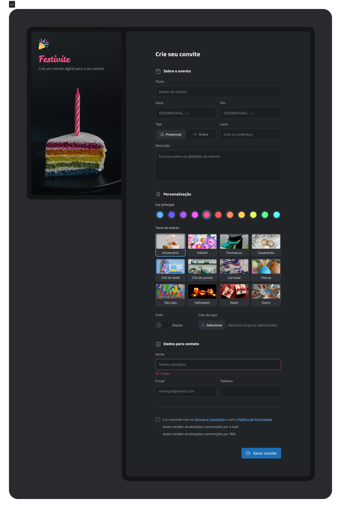

# 🎉 Festivite 

🚀 Um formulário de convite desenvolvido na Formação Fullstack da Rocketseat.



## 📌 Sobre o Projeto
Desafio proposto na Formação Fullstack da Rocketseat para colocar em prática os conhecimentos adquiridos em HTML e CSS durantes as aulas.

---

## 🎯 Objetivo Principal
Desenvolver um formulário de convite apenas utilizando HTML e CSS, simulando um formulário real de convite para dadas comemorativas.

---

## 💻 Tecnologias Utilizadas
- HTML5
- CSS3

---

## 🚀 Instalação e Execução
1. Clone o repositório:
```bash
git clone https://github.com/devalefhilima/Formulario-de-Convite
````
2. Acesse o diretório do projeto:
```bash
cd FORMULARIO-DE-CONVITE
```
3. Abra o arquivo index.html no seu navegador.
